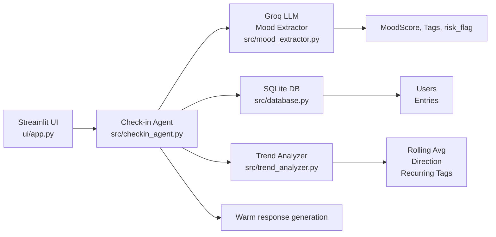

# MindPulse

MindPulse is a lightweight mental wellness journaling and check-in application that helps a user reflect on mood, surface recurring themes, and detect possible risk indicators through a supportive conversational flow.

Built with Python, Streamlit, SQLite, and a Groq-hosted LLM pipeline, MindPulse turns user text into structured mood data, stores it locally, and summarizes trends over time.

## Why MindPulse?

Many wellness and journaling apps ask users to track how they feel, but few connect that reflection with a simple sentiment analysis and trend model. MindPulse brings together three layers:

- A friendly user interface for check-ins
- A structured mood extraction and risk assessment layer
- A trend analysis layer for identifying mood movement and recurring themes

## Features

- Streamlit-based check-in UI
- Mood scoring from 1 to 10
- Automated theme/tag extraction
- User-specific mood and check-in history
- Crisis-risk response flow with safety guidance
- Trend analysis for mood direction, rolling averages, low-mood streaks, and recurring tags
- SQLite storage for users and submitted check-in entries

## Product Architecture



## System Flow

1. A user opens the Streamlit app and creates or selects a user profile.
2. The user answers structured wellness questions.
3. The check-in agent combines the answers into one text payload.
4. The mood extractor uses an LLM structured output pipeline to classify mood, extract tags, and flag potential risk.
5. The check-in agent stores the raw text, mood score, and tags in SQLite.
6. The trend analyzer reads the stored entries and turns them into a summary of mood movement and recurring themes.
7. The UI presents the response and trend metrics to the user.

## Repository Layout

```text
MindPulse/
├── README.md
├── requirements.txt
├── src/
│   ├── checkin_agent.py       # composes check-in flow
│   ├── config.py              # app configuration and LLM settings
│   ├── database.py            # SQLite access helpers
│   ├── mood_extractor.py      # LLM structured output for mood/tag/risk
│   └── trend_analyzer.py     # trend and tag analysis
├── tests/
│   ├── test_database.py
│   ├── test_mood_extractor.py
│   └── test_trend_analyzer.py
└── ui/
    └── app.py                 # Streamlit user interface
```

## Local Setup

### 1. Clone the repository

```bash
git clone <your-repo-url>
cd MindPulse
```

### 2. Create a virtual environment

```bash
python -m venv .venv
source .venv/bin/activate
```

On Windows PowerShell:

```powershell
python -m venv .venv
.\.venv\Scripts\Activate.ps1
```

### 3. Install dependencies

```bash
pip install -r requirements.txt
```

### 4. Configure environment variables

Create a `.env` file in the project root with your Groq API key:

```env
GROQ_API_KEY=your_groq_api_key_here
```

The project uses the settings in `src/config.py` for:

- LLM provider: Groq
- Model: `openai/gpt-oss-20b`
- Temperature: `0.3`
- Maximum tokens: `500`

## Running the App

Start the Streamlit UI from the project root:

```bash
streamlit run ui/app.py
```

The app will initialize the SQLite database automatically when the UI starts.

## Running Tests

```bash
pytest
```

## Data Model

MindPulse stores two main tables in SQLite:

- `users`: user profile records
- `entries`: check-in records containing raw text, mood score, tags, and timestamps

The `entries` table is the main data source for the trend analyzer.

## Example User Journey

1. A user supplies a name.
2. The app collects answers to wellness prompts.
3. The API extracts mood signals, risk indicators, and themes.
4. A supportive reply is generated.
5. The app saves each record and shows trends such as average mood and direction of change.

## Limitations and Safety Notes

MindPulse is designed as a non-clinical wellness reflection assistant. Its risk response is not a substitute for professional mental health care.

The current implementation uses a developer-facing LLM extraction setup and should be treated as a prototype or research-oriented app. For production, it is recommended to add:

- Authentication and user accounts
- Data privacy controls and encryption
- Human review and escalation for flagged entries
- Better crisis response integrations
- Dashboard and analytics improvements

## Roadmap

Potential future enhancements include:

- Personalized check-in schedules and reminders
- Visual reports and charts for mood, tags, and streaks
- User identity and secure storage
- Deeper safety routing for urgent entries
- Clinical integration and privacy-first architecture

## License

This project is provided as an educational or internal-use project. Add your preferred license if you intend to share it publicly.
