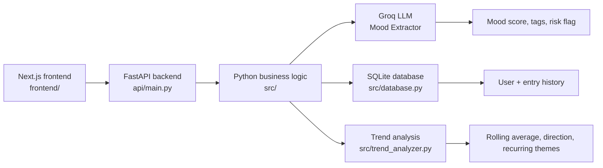

# MindPulse

MindPulse is a wellness check-in and mood-tracking app designed to help people reflect on how they feel, identify recurring themes, and surface risk cues in a supportive way.

The project combines a Python backend with a Next.js frontend. The backend uses a Groq-powered LLM pipeline to extract mood, tag themes, and potential risk indicators from user responses, while the frontend presents the check-in flow and trend dashboard.

## What it does

- Captures a user profile and daily check-ins
- Asks structured wellness questions
- Analyzes mood on a 1-10 scale
- Extracts tags and recurring themes
- Flags high-risk entries with a crisis-safe response
- Stores entries in SQLite and summarizes trends over time
- Displays check-in history and mood trends in the web UI

## Architecture



## Repository structure

```text
MindPulse/
├── README.md
├── requirements.txt
├── api/
│   └── main.py                  # FastAPI app and HTTP routes
├── frontend/
│   ├── package.json             # Next.js app config and scripts
│   ├── src/
│   └── README.md                # Frontend-specific instructions
├── src/
│   ├── checkin_agent.py         # Orchestrates mood extraction and response generation
│   ├── config.py                # API keys and app settings
│   ├── database.py              # SQLite access layer
│   ├── mood_extractor.py        # LLM-based extraction logic
│   └── trend_analyzer.py        # Trend and tag analysis
├── tests/
│   ├── test_database.py
│   ├── test_mood_extractor.py
│   └── test_trend_analyzer.py
├── ui/
│   └── app.py                   # Older Streamlit prototype
└── .env                         # Local environment variables (not committed)
```

## Tech stack

- Backend: Python, FastAPI, SQLite, LangChain, Groq
- Frontend: Next.js, React, TypeScript, Tailwind CSS
- Data analysis: pandas, numpy, plotly
- Testing: pytest

## Local setup

### 1. Clone the repo

```bash
git clone <your-repo-url>
cd MindPulse
```

### 2. Create and activate a Python environment

```bash
python -m venv .venv
```

On macOS/Linux:

```bash
source .venv/bin/activate
```

On Windows PowerShell:

```powershell
.\.venv\Scripts\Activate.ps1
```

### 3. Install backend dependencies

```bash
pip install -r requirements.txt
```

### 4. Add environment variables

Create a `.env` file in the project root:

```env
GROQ_API_KEY=your_groq_api_key_here
```

The backend configuration is defined in `src/config.py` and includes:

- LLM provider: `groq`
- Model: `openai/gpt-oss-20b`
- Temperature: `0.3`
- Max tokens: `500`

## Run the backend

From the project root:

```bash
uvicorn api.main:app --reload --port 8000
```

The API will be available at:

- http://localhost:8000/docs
- http://localhost:8000/api/health

## Run the frontend

In a second terminal, from the `frontend` directory:

```bash
cd frontend
npm install
npm run dev
```

Then open:

- http://localhost:3000

## API overview

The backend exposes these routes:

- `GET /api/health` — health check
- `GET /api/questions` — returns the wellness questions shown in the app
- `POST /api/users` — creates a new user
- `POST /api/checkin` — runs the mood extraction and check-in pipeline
- `GET /api/entries` — fetches recent check-ins for a user
- `GET /api/trends` — returns trend data for mood direction and tags

## Testing

Run the backend test suite from the project root:

```bash
pytest
```

## Data model

MindPulse stores user and check-in data in SQLite. Primary records include:

- `users` — user profile information
- `entries` — raw text, timestamp, mood score, tags, and associated user ID

These tables power the history and trend analysis shown in the UI.

## Example user flow

1. A user creates a profile in the frontend.
2. The UI asks four wellness questions.
3. The backend combines answers into a single check-in payload.
4. The LLM extracts mood, tags, and risk signals.
5. The app saves the entry and returns a supportive reply.
6. The trend analyzer reads historical entries to summarize mood movement and recurring themes.

## Safety and limitations

MindPulse is a wellness reflection tool, not a clinical diagnosis system. The crisis branch is designed to encourage support-seeking and emergency assistance when risk signals are present, but it is not a substitute for professional care.

For production use, consider adding:

- User authentication and protected data handling
- Encryption and stronger privacy controls
- Escalation tooling for high-risk cases
- Improved monitoring and operational logging
- More robust quality assurance around LLM outputs

## Roadmap

Possible next steps include:

- Personalized check-in reminders
- More advanced mood analytics and visualizations
- Better user identity management
- Export and journaling tools
- Deeper safety routing and crisis workflows

## License

This project is currently provided for educational and internal-use purposes. Add a formal license file if you intend to share or distribute it publicly.
